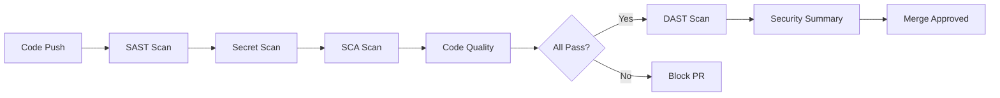

# SurvivalTrait DevSecOps Pipeline

## 🛡️ Overview

This repository implements a **complete, free DevSecOps pipeline** with:

- ✅ **SAST** (Static Application Security Testing) via Semgrep
- ✅ **DAST** (Dynamic Application Security Testing) via OWASP ZAP  
- ✅ **SCA** (Software Composition Analysis) via Trivy
- ✅ **Secret Scanning** via TruffleHog
- ✅ **Code Quality** checks and validation
- ✅ **Change Management** with PR reviews and branch protection
- ✅ **Automated Dependency Updates** via Dependabot

**Total Cost:** $0 (All tools are free for public repositories)

---

## 🚀 Quick Start

### Option 1: Automated Setup (Recommended)

```bash
# Run the setup script
chmod +x setup-devsecops.sh
./setup-devsecops.sh

# Push to GitHub
git push -u origin main
```

### Option 2: Manual Setup

1. Copy all pipeline files to your repository
2. Commit and push:
   ```bash
   git add .github/ .zap/ .gitignore SECURITY.md
   git commit -m "feat: Add DevSecOps pipeline"
   git push
   ```

3. Enable GitHub security features (see guide below)

---

## 📁 Pipeline Files

```
.
├── .github/
│   ├── workflows/
│   │   └── devsecops.yml           # Main CI/CD pipeline
│   ├── dependabot.yml              # Automated dependency updates
│   └── PULL_REQUEST_TEMPLATE.md    # PR security checklist
├── .zap/
│   └── rules.tsv                   # OWASP ZAP scan rules
├── .gitignore                      # Prevents committing secrets
├── SECURITY.md                     # Security policy & contact
├── DEVSECOPS_GUIDE.md             # Comprehensive implementation guide
└── setup-devsecops.sh             # Automated setup script
```

---

## 🔒 Security Scanning

### What Gets Scanned

| Scan Type | Tool | Frequency | Purpose |
|-----------|------|-----------|---------|
| **SAST** | Semgrep | Every commit | Find code vulnerabilities |
| **DAST** | OWASP ZAP | Main branch + Weekly | Test running application |
| **SCA** | Trivy | Every commit | Check dependencies |
| **Secrets** | TruffleHog | Every commit | Detect exposed credentials |
| **Quality** | HTMLHint, Stylelint | Every commit | Code quality & standards |

### Pipeline Workflow



---

## ⚙️ GitHub Configuration

### Enable Security Features

1. Navigate to **Settings** → **Security** → **Code security and analysis**
2. Enable:
   - ✅ Dependency graph
   - ✅ Dependabot alerts
   - ✅ Dependabot security updates
   - ✅ Secret scanning
   - ✅ Code scanning (CodeQL)

### Configure Branch Protection

1. Go to **Settings** → **Branches**
2. Add rule for `main` branch:

```
Required Settings:
✅ Require pull request before merging
   ├─ Require approvals: 1
   └─ Dismiss stale PR approvals
   
✅ Require status checks to pass
   ├─ SAST - Semgrep Security Scan
   ├─ Secret & Credential Scanning
   ├─ SCA - Dependency Security Scan
   ├─ Code Quality Analysis
   └─ Build & Validation
   
✅ Require conversation resolution

✅ Restrict who can push
```

---

## 📊 Viewing Results

### Security Alerts

- **Location:** Repository → **Security** tab
- **Types:** Code scanning alerts, Dependabot alerts, Secret scanning
- **Actions:** Review, dismiss, or create issue

### PR Checks

Every pull request shows:
- ✅ Security scan results
- ⚠️ Warnings and findings
- ❌ Blocking issues

### Workflow Runs

- **Location:** Repository → **Actions** tab
- View detailed logs for each security scan
- Download SARIF reports for offline analysis

---

## 🔧 Customization

### Adjust Scan Sensitivity

Edit `.zap/rules.tsv` to change OWASP ZAP thresholds:

```tsv
# Format: RULE_ID    THRESHOLD    ACTION
40012    FAIL    # XSS - block PR
10096    WARN    # Timestamp disclosure - warning only
10015    IGNORE  # Cache headers - ignore for static sites
```

### Modify Workflow Triggers

Edit `.github/workflows/devsecops.yml`:

```yaml
on:
  push:
    branches: [ main, develop, staging ]  # Add branches
  schedule:
    - cron: '0 2 * * 0'  # Change schedule
```

### Add Custom Security Checks

Add new jobs to the workflow:

```yaml
custom-security-check:
  name: Custom Security Validation
  runs-on: ubuntu-latest
  steps:
    - uses: actions/checkout@v4
    - name: Run custom checks
      run: ./scripts/custom-security.sh
```

---

## 🐛 Troubleshooting

### Common Issues

**Pipeline fails immediately:**
```bash
# Check workflow syntax
cat .github/workflows/devsecops.yml

# Validate YAML
yamllint .github/workflows/devsecops.yml
```

**DAST scan times out:**
- Increase timeout in workflow (default: 30 minutes)
- Reduce scan scope in `.zap/rules.tsv`

**Too many false positives:**
- Adjust rule thresholds in `.zap/rules.tsv`
- Add exceptions to Semgrep config

**Dependabot overwhelming:**
- Reduce `open-pull-requests-limit` in `dependabot.yml`
- Group updates: `groups.dependencies`

---

## 📚 Documentation

- **[DEVSECOPS_GUIDE.md](DEVSECOPS_GUIDE.md)** - Complete implementation guide
- **[SECURITY.md](SECURITY.md)** - Security policy and vulnerability reporting
- **[.github/PULL_REQUEST_TEMPLATE.md](.github/PULL_REQUEST_TEMPLATE.md)** - PR checklist

### External Resources

- [Semgrep Documentation](https://semgrep.dev/docs/)
- [OWASP ZAP Documentation](https://www.zaproxy.org/docs/)
- [Trivy Documentation](https://aquasecurity.github.io/trivy/)
- [GitHub Actions Documentation](https://docs.github.com/en/actions)

---

## 🎯 Best Practices

### Development Workflow

1. **Never commit directly to main**
   ```bash
   git checkout -b feature/your-feature
   # Make changes
   git commit -m "feat: description"
   git push origin feature/your-feature
   # Create PR on GitHub
   ```

2. **Complete PR checklist** - Don't skip security items

3. **Review security findings** - Address before merging

4. **Keep dependencies updated** - Review Dependabot PRs promptly

### Security Practices

- ✅ Use environment variables for secrets
- ✅ Review all security alerts within 48 hours
- ✅ Test security updates in staging first
- ✅ Maintain audit trail via PRs
- ✅ Document security decisions

---

## 📈 Metrics

Monitor your security posture:

- **Security Alerts:** Repository → Security tab
- **Vulnerability Count:** Track open vs. fixed
- **Scan Coverage:** Ensure all code paths tested
- **Response Time:** Average time to fix vulnerabilities

---

## 🆘 Support

**Documentation Issues:**
Open an issue in this repository

**Security Vulnerabilities:**
Email: info@survivaltrait.com (see SECURITY.md)

**General Questions:**
Check DEVSECOPS_GUIDE.md first

---

## 📝 License

This DevSecOps pipeline configuration is provided as-is for the SurvivalTrait project.

---

## 🙏 Acknowledgments

Built with free, open-source tools:
- [Semgrep](https://semgrep.dev/) by Semgrep, Inc.
- [OWASP ZAP](https://www.zaproxy.org/) by OWASP Foundation
- [Trivy](https://trivy.dev/) by Aqua Security
- [TruffleHog](https://trufflesecurity.com/) by Truffle Security
- [GitHub Actions](https://github.com/features/actions) by GitHub

---

**Last Updated:** December 28, 2025  
**Version:** 1.0.0
